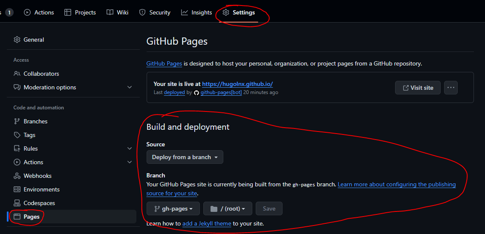

## hugolnx.github.io

This is the repository for my game developer portfolio website. 
You can fork it and use, but please keep the credits at the footer.

### Technologies Used

* Front-end:
    * Vike ([https://vike.dev/](https://vike.dev/))
    * Vue.js ([https://vuejs.org/](https://vuejs.org/))
    * Bulma ([https://bulma.io/](https://bulma.io/))
    * Babel ([https://babeljs.io/](https://babeljs.io/))
    * Sass ([https://sass-lang.com/guide/](https://sass-lang.com/guide/))
* Package manager: npm ([https://www.npmjs.com/](https://www.npmjs.com/))

### Features

* No Server: Doesn't need a server, any CDN hosting will do.
* SEO: All pages are pre-rendered, so the first request get the whole content.
* Performance: After the first request, it's a common single page application.
* Integrated with Github Pages
* Responsive: This website was made mobile-first and it has responsive styling.

### Theme
For styling this website uses [Bulma](https://bulma.io/) with the [Darkly theme](https://jenil.github.io/bulmaswatch/darkly).
So it shouldn't be too complicated to switch to other [Bulmaswatch Theme](https://jenil.github.io/bulmaswatch/), you'll just
need to review the colors I set manually, maybe in a future version I get it all centered in a single `variables.scss` file.

### Setup

1. Clone this repository:

   ```bash
   git clone https://github.com/hugolnx/hugolnx.github.io.git
   ```

2. Install dependencies:

   ```bash
   npm install
   ```

### Development

1. Start the development server:

   ```bash
   npm run dev
   ```

   This will start a local server at http://localhost:3000

2. Make code changes and watch the browser reload automatically.


### Deploy
1. Configure Github Pages to deploy from the branch `gh-pages`.


2. Push to `main`.

3. Check if your deploy succeeded in your [Repository's Actions Page](https://github.com/HugoLnx/hugolnx.github.io/actions).


### Tasks

* Emulate final build being served

    ```bash
    npm run emulate
    ```

* Force deploy (works with any branch)
    By default only the branch `main` is deployed on push, but with this task you can force it to
    deploy the current branch.

    ```bash
    npm run force-deploy
    ```

### Build

To build the production-ready version of the website, run:

```bash
npm run build
```

The built files will be placed in the `dist` folder. You can deploy the contents of this folder to your web server.

### Google Search Console
You can verify your website on Google Search Console via metatag verification. To test that, put
your metatag token (generated by google) into `.env` file as the env var `VITE_GOOGLE_SITE_VERIFICATION`.
Then, when you run serve the app it should have the metatag there.  

To make it work in github pages you just need to register `VITE_GOOGLE_SITE_VERIFICATION` at your github repository
as a secret.

### Issues
* LFS Bandwidth / Storage Limit: Avoid having useless videos and images in the repository because every deploy makes
  a full clone, which consumes LFS bandwidth. Github gives 1GB of LFS bandwidth per month for free, so if you have 50mb
  on LFS you'll be able to do 20 deploys per month.

### License

This project is licensed under the GNU General Public License v3.0. You can find the full text of the license [here](https://www.gnu.org/licenses/gpl-3.0.en.html).
